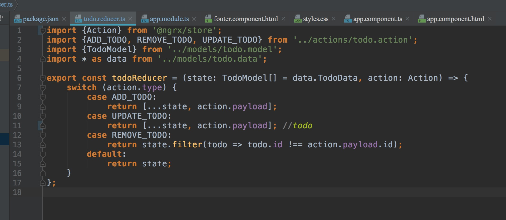
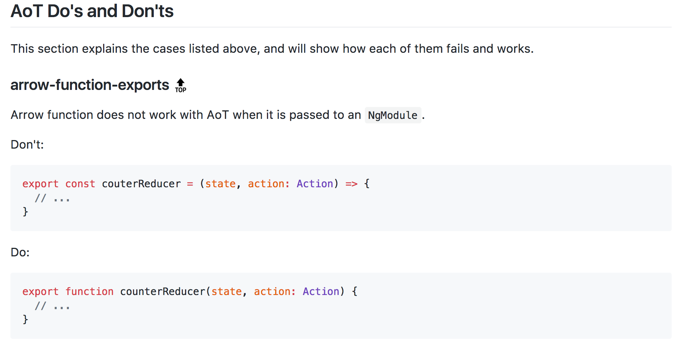
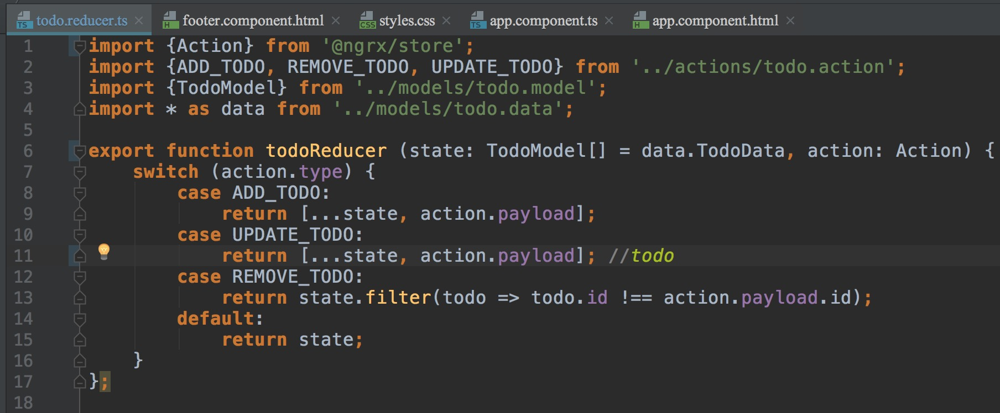

---

断断续续，这个项目只在没事的时候完成一下，但这绝不是一个错误报一个月的理由😅。。
```
ERROR in Error encountered resolving symbol values statically. Function calls are not supported. Consider replacing the function or lambda with a reference to an exported function (position 6:28 in the original .ts file), resolving symbol todoReducer in /Users/neo/workspace/Todooo/src/app/reducer/todo.reducer.ts, resolving symbol AppModule in /Users/neo/workspace/Todooo/src/app/app.module.ts
```
code:


[官网这样说的🤦‍♂️🤦‍♂️捂脸](https://github.com/rangle/angular-2-aot-sandbox#arrow-function-exports-top)


修改后：



🤦‍♂️🤦‍♂️
到这时候已然是生无可恋。。。